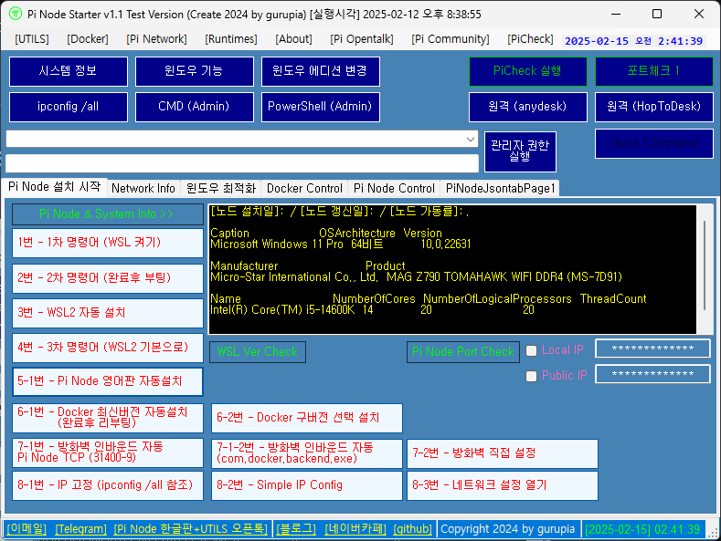

# PiNodeStarter
Pi Node Starter v1.1  - GUI Util (Pi Node Starter v1.1-gurupia.7z) - updated 2025.03.08

Pi Node Starter Downloader - CUI Util (PiNodeStarter_Downloader.7z) - update 2025.02.19

[변경 사항]
- Pi Network Node 0.5.1 / Pi Check 19.0.0 Download 지원 업데이트 (2025.03.08) 
- Pi Check 19.0.0 Download 후 구버전에 덮어쓰기 방식으로 기능 변경 (2025.03.08) - Active
- Docker Desktop 4.39.0 Download 지원 (2025.03.08)

<해당 프로그램을 사용하는 것에 대한 고지 사항>

공개 테스트 버전으로 누구나 자유롭게 다운로드하여 사용하실 수 있으나 유틸을 사용한 영리적 목적의 이용은 불허합니다.

[카카오톡 오픈 톡 방] 인원제한 50명 
https://open.kakao.com/o/g44sHwee

톡 방은 보안 서클, 레퍼랄, 지인들과 원활한 소통을 위해 개설되었지만 테스트 노드 초창기에 파이 커뮤니티에서 해결하기 어려운 기술적 문제 등에 대한 질문이 많아 이에 대한 주제 및 기타 블록체인 관련 기술에 대한 토론도 가능하도록 범위를 확장하였습니다. 
노드 관련 기초적인 질문 등은 파이 관련 카페나 다른 톡 방을 이용해 주시기 바랍니다.

[텔레그램 채널]
https://t.me/+bevFA-V6CIljNDQ9

Pi Node 한글판 + Pi Node 유틸 - Pi NODE 설치 지원용으로 개설. 노드는 본인이 직접 해봐야하고 할 줄 알아야합니다. (Admin: gurupia)
t.me

텔레그램 채널은 개인 작업 공간 및 지인 초대로 운영하다가 테스트 노드 시작할 때 노드 한글 버전 공개 테스트 진행을 위해서 공개한 뒤로 계속 열어두고 있습니다.

특별한 정보는 없고 시간 날 때 작업한 것을 기록할 목적으로 개설한 채널이라 파이 관련 전반적인 정보는 커뮤니티나 다른 채널을 이용해 주시기 바랍니다.

[Pi Wallet] GDNBMMYUYXCNX5XPQFJVJDT7DD42BSLSFOLEO4FL2BJXDPMTGYVA7IRR

[<a href="https://github.com/pi-node/instructions/wiki">Pi Node Wiki</a> 기계번역]

노드는 파이 생태계의 네 번째 역할로, 휴대폰 대신 노트북과 데스크톱에서 실행됩니다. 

다른 블록체인과 마찬가지로 파이 노드는 분산 원장에서 거래를 검증하고 모든 노드가 기록 중인 신규 거래 순서에 대해 "합의"를 도출하여 분산 통화를 유지하는 데 어려움을 해결하는 역할을 합니다.

비트코인이나 이더리움과 같은 작업 증명을 사용하는 노드와 달리 파이 노드는 스텔라 컨센서스 프로토콜(SCP)을 기반으로 하는 다른 합의 알고리즘을 사용합니다. 
SCP에서 노드는 신뢰할 수 있는 그룹(쿼럼 슬라이스)을 구성하며, 신뢰할 수 있는 노드가 동의하는 트랜잭션에만 동의합니다. 
파이 모바일 채굴기의 보안 서클(파이 FAQ 참조: 보안 서클이란?)은 파이 노드가 쿼럼 슬라이스를 구성하여 공유 원장에서 트랜잭션을 검증할 수 있는 사람과 검증할 수 없는 사람을 결정할 수 있는 글로벌 신뢰 그래프로 통합됩니다.

대부분의 다른 암호화폐 프로젝트와 달리 파이 노드는 사용자 중심 설계의 철학을 계속 따를 것입니다. 일반인은 노드를 설정하는 데 깊은 기술 지식이 필요하지 않고 컴퓨터에 데스크톱 애플리케이션을 설치하여 노드를 설정할 수 있습니다. 파이오니어스는 이 컴퓨터 애플리케이션을 통해 노드 소프트웨어를 켜거나 끄면 노드 역할을 할 수 있는 디바이스를 사용할 수 있습니다.

파이는 테스트넷을 개발하는 동안 점진적 탈중앙화의 방법론을 계속 고수할 것입니다. 
초기 테스트넷에서 노드 소프트웨어의 Pi 블록체인 구성 요소는 시나리오 스트레스 테스트의 더 빠른 반복과 Pi 네트워크와 글로벌 커뮤니티의 요구를 수용하기 위한 합의 알고리즘의 적응을 달성하기 위해 중앙 집중식 계층을 갖게 됩니다(섹션 - 테스트넷 로드맵 참조). 
이 노드의 초기 버전은 파이 테스트넷과 궁극적으로 완전히 탈중앙화된 메인넷을 구축하기 위한 첫 번째 단계입니다.

이 버전의 노드에는 노드 인터페이스와 데스크톱 파이 앱 인터페이스의 두 가지 인터페이스가 포함되어 있습니다. 
아래 섹션에 정의된 참여 수준에 따라 파이오니어는 그에 따라 두 인터페이스를 사용할 수 있습니다. 
모든 모바일 사용자는 노드 소프트웨어를 컴퓨터에 다운로드하여 데스크톱 파이 앱 인터페이스를 사용할 수 있는데, 이 인터페이스는 모바일 앱과 유사한 인터페이스이며 개인 컴퓨터에서 파이 잔액을 확인하고 미디어 콘텐츠를 시청하며 파이 채팅을 사용할 수 있기 때문입니다.
 모든 파이오니어는 노드 인터페이스를 통해 노드가 되기 위해 신청하고 거기에 블록체인 구성 요소를 설치할 수도 있습니다. 
처음에는 핵심 팀이 장치 안정성과 연결성을 기반으로 노드 선택 기준을 보정할 수 있는 선택 단계(섹션 - 테스트넷 로드맵 참조)가 있을 것입니다. 코어 팀에서 노드를 선택하면 테스트넷에서 노드 역할을 수행하려면 KYC를 통과해야 합니다.

<h3>파이 노드 FAQ</h3>
파이 노드 소프트웨어와 파이 네트워크 모바일 애플리케이션의 관계는 무엇인가요?

노드와 모바일 앱은 상호 배타적이지 않고 상호 보완적입니다. 
모바일 앱 계정을 통해 노드 소프트웨어에 로그인하게 되므로 데스크톱 앱과 모바일 앱 모두 동일한 파이 계정을 가리키고 있습니다. 
파이 정책에 따라 한 사람만 파이 계정을 가질 수 있으며, 현재로서는 한 계정만 하나의 노드만 실행해야 합니다. 모바일 마이닝은 모바일 앱에서만 시작할 수 있으며, 노드의 데스크톱 Pi App 인터페이스를 사용하면 홈 화면에서 잔액을 확인하고 채팅하며 미디어 콘텐츠를 시청할 수 있습니다. 
계정에 노드가 있는지 여부는 모바일 앱의 모든 기능에 영향을 미치지 않습니다. 

<h3>파이 노드가 내 장치에 미치는 영향은 무엇입니까? CPU와 배터리가 소모되나요?</h3>

노드 또는 슈퍼노드 부품을 켜지 않으면 영향이 미미하므로 CPU, 메모리 또는 네트워크 트래픽이 거의 소모되지 않으므로 모든 사람이 액세스할 수 있습니다. 
노드 또는 슈퍼노드 기능을 켜면 CPU, 메모리, 하드 드라이브 및 네트워크 리소스가 사용됩니다. 
테스트넷 과정에서 노드 실행이 특정 디바이스에 미치는 영향을 보다 명확하게 파악하기 위해 데이터를 수집할 것입니다. 

<h3>파이 노드를 실행하면 보상이 있나요?</h3>

파이의 테스트넷의 목표 중 하나는 노드를 실행하면 어떤 보상이 있어야 하는지 결정하는 것입니다. 
가장 적절한 인센티브 메커니즘을 결정하는 데 필요한 관련 데이터를 수집하지만, 테스트넷 노드에 대한 채굴 보상은 없습니다. 

<h3>파이 노드 소프트웨어가 오픈 소스입니까?</h3>

노드의 블록체인 구성 요소는 오픈 소스가 됩니다. 오픈 소싱을 진행할 수 있도록 깃허브 저장소를 정리하는 중입니다. 
우리는 커뮤니티 구성원이 원할 경우 기여할 수 있는 미해결 이슈 목록을 깃허브 저장소에 직접 유지하는 것을 목표로 합니다. 채널을 고정해 주십시오. 
커뮤니티에서 파이 앱 기능에 대한 위키 니드 지침에 대한 답변을 찾으시겠습니까? 의장이 생성한 커뮤니티 위키 페이지를 방문하여 가입 방법, 계정 확인 방법 또는 문제 해결 방법과 같은 추가 정보 및 지침을 확인하세요.
커뮤니티 위키 페이지는 파이 채팅 중재자 커뮤니티에서 편집 및 유지 관리하며 파이 코어 팀의 공식 성명서가 아닙니다. 커뮤니티 위키

<h3>지원 포털 살펴보기</h3>

파이 앱 또는 파이 계정에 문제가 있습니까? 지원 포털에서 버그를 보고하거나 이메일을 보냅니다. 이메일 요청을 제출하기 전에 이 문제에 대한 관련 커뮤니티 위키를 읽어보세요. 지원 포털

